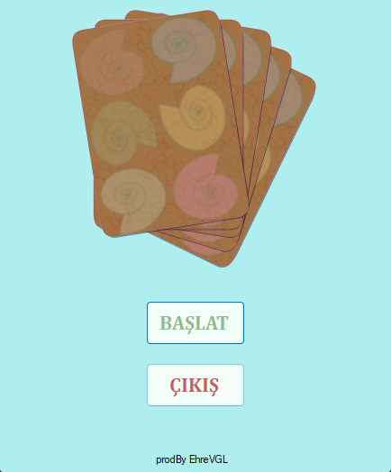
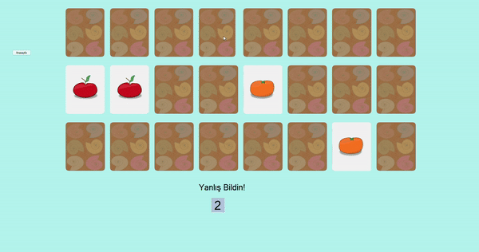

# Kart Hafıza Oyunu - C# Windows App Uygulaması

## Herkese Selamlar

Bu proje, C#'a başladığım zaman yapmış olduğum ilk projelerden birisi. 
Bu projeyi yapmamdaki amaç; C# dilini öğrenmeye yeni başlamış birisi olarak, 'Windows App' uygulaması yaparken nelerle karşılaşabileceğimi kolay bir uygulama ile görmekti.

Basit düzeyde animasyonlu geçişler yapmayı denemek istemem üzerine böyle bir uygulama ortaya çıktı.

## İçindekiler

0. [Herkese Selamlar](#herkese-selamlar)
1. [Uygulama Hakkında](#uygulama-hakkında)
2. [Youtube Linki](#youtube-linki)

## Uygulama Hakkında

Oyun, uygulamanın **BAŞLAT** butonuna tıklandığı zaman başlar. Bir süre boyunca masadaki kartlar gösterilir ve hepsi ters çevrilir. Bütün kartların eşleri bulunduğu zaman oyun bitirilir.

Oyun içi kısa bir görüntü:

## Youtube Linki

Youtube üzerinden paylaştığım uygulama videosuna [bu linkten](https://youtu.be/Jdh5mykBFf8) ulaşabilirsiniz.
